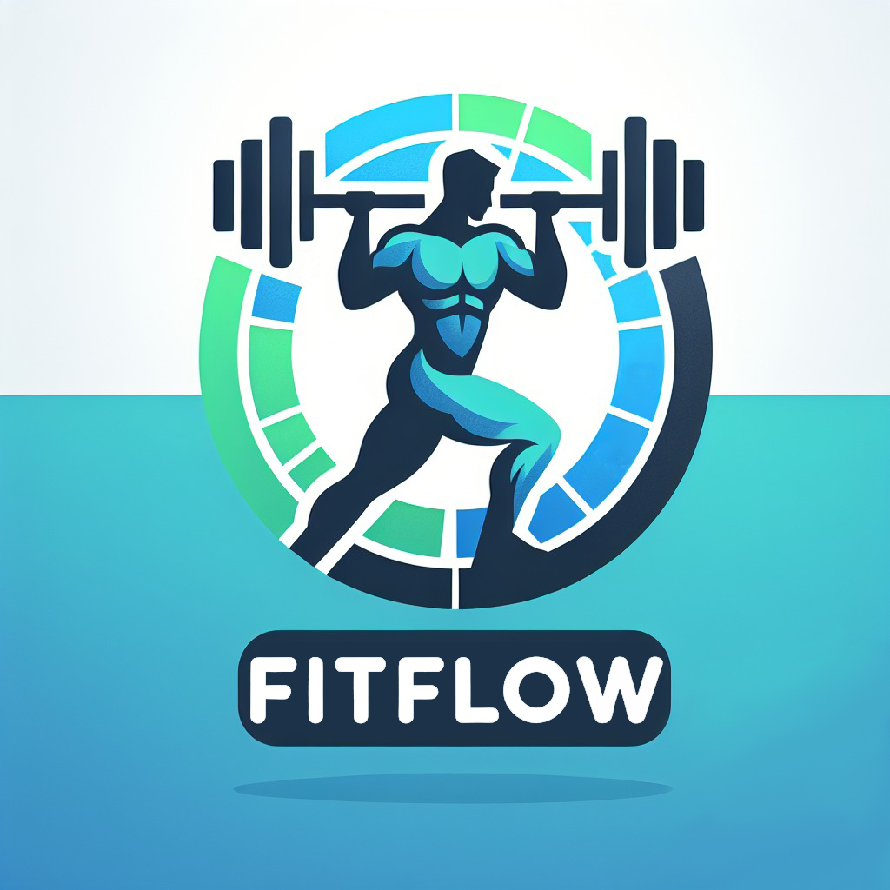

# FitFlow
Application to create routines and share them (FP final project)
____________________________________________________________________________________
## Backend Technologies
Backend is created with:
### Core Libraries
* Spring Boot: 3.2.4
* Spring Boot Starter Web
### Data Access
* Spring Boot Starter Data JPA
* PostgreSQL: 16.2
### Code Quality
* Lombok: 1.18.32
* MapStruct: 1.5.5.Final
### Documentation
* Springdoc OpenAPI: 2.2.0
### Testing
* JUnit: 5
  
 
____________________________________________________________________________________
## Frontend Technologies
Frontend is created with:
### Core Libraries
* Vue.js: 2.6.14
* Vue Router: 3.5.1
* Vuex: 3.6.2
* TypeScript 4.5.5
### UI Libraries
* Bootstrap: 5.3.3
* Bootstrap Vue: 2.17.3
* Vuetify: 2.7.2
* Vue2 Dropzone: 3.6.0
### Charting
* Chart.js: 4.4.3
### PDF Generation
* jsPDF: 2.5.1
### WebSockets
* StompJS: 2.3.3
### Additional Libraries
* Axios: 1.6.8
____________________________________________________________________________________
## Logotype Concept

